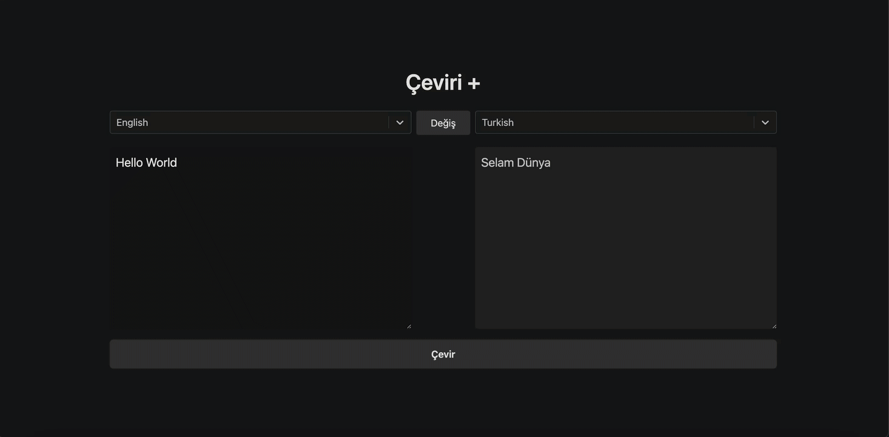

# Translate Application

This project is a **Translate Application** that enables users to translate text between different languages. It is built using **React** and leverages **Redux Toolkit** and **Redux Thunk** for state management and handling asynchronous operations.

---

## Features

- **API Integration**: Translations are fetched dynamically via API requests.
- **Language Selection**: Users can select source and target languages for translation using a dropdown menu.
- **Real-Time Translations**: Translations are updated instantly upon text input.
- **State Management**: Efficiently managed with Redux Toolkit.
- **User-Friendly Interface**: Simple and responsive design for easy interaction.

---

## Technologies Used

- **React**: Frontend library for building the user interface.
- **Redux Toolkit**: State management library.
- **Redux Thunk**: Middleware for handling asynchronous operations.
- **React-Select**: For customizable dropdown menus.
- **Axios**: For making API requests.

